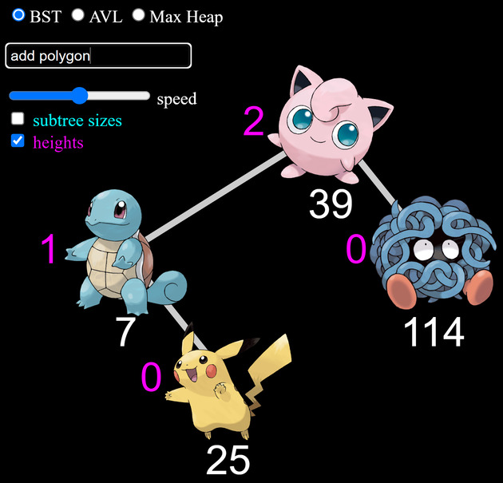

# PokeTree: BSTs with Pokémon

***PokeTree*** is a web app for visually demonstrating and animating
**[Binary Search Trees (BSTs)](https://en.wikipedia.org/wiki/Binary_search_tree)**
and **[AVL trees](https://en.wikipedia.org/wiki/AVL_tree)**.

## [Try It Out!](https://edemaine.github.io/poketree/)

## Usage

### Commands

The main interface is the text box in the top left.
You can enter one of the following commands:

* `clear`: Reset the tree to be empty.
* `f key`/`find key`: Perform binary search to find the given key.
* `a key`/`add key`/`i key`/`ins key`/`insert key`: Insert the given key
  using the vanilla BST algorithm, without any rebalacing.
* `ai key`/`avlins key`/`aa key`/`avladd key`: Insert the given key
  using the AVL algorithm.
  If you just use AVL operations, the height remains logarithmic.
* `d key`/`del key`/`delete key`/`rem key`/`remove key`: Delete the given key
  using the vanilla BST algorithm, without any rebalacing.
* `ad key`/`avldel key`/`avlrem key`: Delete the given key
  using the AVL algorithm.
  If you just use AVL operations, the height remains logarithmic.
* `avl key`: Run the AVL restoration algorithm on the path from the specified
  node to the root.  If you accidentally one vanilla BST insert or delete,
  you can run this operation just above it to restore AVL balance
  (if you had an AVL tree before).
* `r key`/`rotr key`/`rotater key`:
  Rotate-right the node containing the given key and its left child.
* `l key`/`rotl key`/`rotatel key`:
  Rotate-left the node containing the given key and its right child.

Each `key` can be an **integer** or a **Pokémon name** (up to Generation VIII).

* If you enter a Pokémon name, it gets converted into the corresponding
  [National Pokédex number](https://bulbapedia.bulbagarden.net/wiki/List_of_Pok%C3%A9mon_by_National_Pok%C3%A9dex_number).
  It's OK if you have typos in the name, or only enter a prefix;
  we match the Pokémon with a name prefix of the smallest possible edit distance.
* If you enter an integer outside the range [1, 905]
  (including zero or negative integers),
  it gets treated as that integer,
  but drawn as the Pokémon whose National Pokédex number is the same modulo 905.

You can also specify multiple keys for one operation, e.g., `aa 1 2 3 4`.

### Augmentations

You can use the checkboxes to toggle display of two properties next to each node:

* **Heights** (magenta, left):
  The height of a node is the length of the longest downward path from the node.
  (An important part of the AVL balancing algorithm.)
* **Subtree sizes** (cyan, right):
  The number of nodes in the subtree rooted at the node,
  i.e., number of descendants including the node itself.
  (Useful for illustrating sequence binary trees,
  which support accessing the *i*th node in traversal order.)

### Speed

You can also speed up or slow down the animations by dragging the slider.

## Credits

[Brynmor Chapman](https://people.csail.mit.edu/brynmor/)
wrote the original version of this demo,
which used Python, specifically Tkinter's Canvas widget.
[Erik Demaine](https://erikdemaine.org/) added some features
and ported the code to the web platform,
specifically using [Pug](https://pugjs.org/),
[Stylus](https://stylus-lang.com/), and [Civet](https://civet.org/).
Both versions were made as teaching aids for the MIT class
[6.1210: Introduction to Algorithms](https://student.mit.edu/catalog/m6a.html#6.1210).

Thanks to [HybridShivam/Pokemon](https://github.com/HybridShivam/Pokemon/)
for providing the Pokémon images, based on
[Bulbapedia](https://bulbapedia.bulbagarden.net/wiki/Main_Page).
